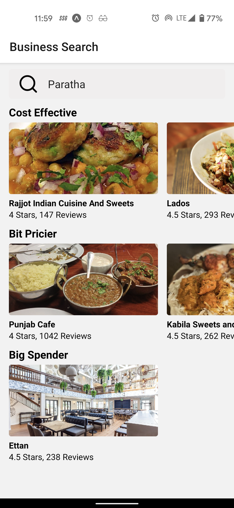
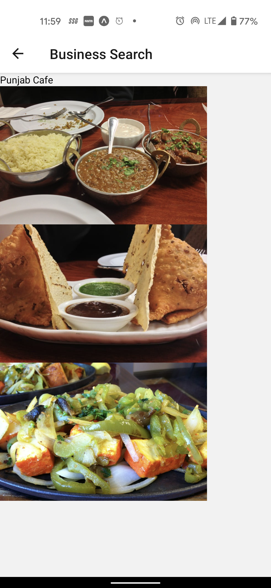

# Screenshots

## 1. After typing "Paratha" on Search Bar

 

## 2. After Clicking on a Restaurant named "Punjab Cafe"

 
 

# How to run this project on your local system

1. Ensure you have git, npm and expo installed on your PC and install Expo App on you mobile application.
2. Clone this repository into your local system.
3. Open this repository in a terminal.
4. Type `npm install` to install node modules and dependencies.
5. Type `npm start` to run the project
6. Scan the project using expo app
